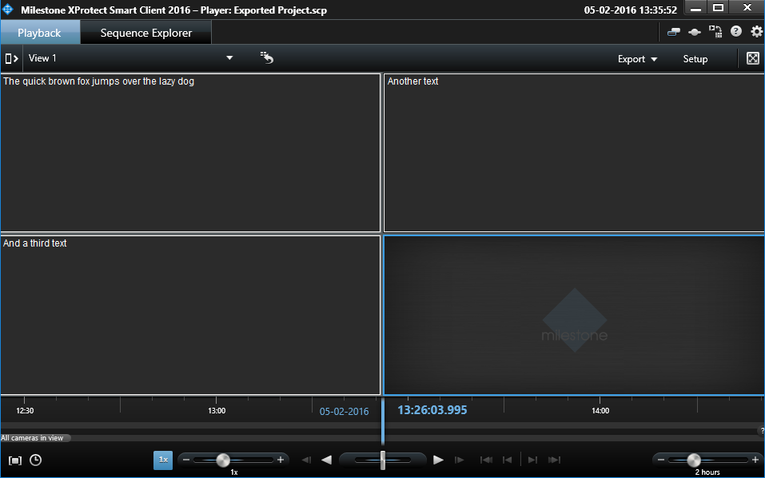

# Smart Client View Item Export

This sample demonstrates how to write a plug-in that can export view
items. It is important to note that the export format is entirely
controlled by the plug-in. This also means that reading the data in
offline mode is left to the plug-in.

This figure shows the Smart Client in offline mode with three Data
Export view items and the exported data imported back again.

## How to use this sample

-   Make sure the Smart Client has access to the sample
-   Start the Smart Client and log in
-   Create a view and add the DataExport view item to it
-   Write some text in the sample view
-   Start an export and add the Data Export view item to the export
-   When the export is complete, open the exported project
-   See that the text written is displayed in offline mode

## The sample demonstrates

-   How to export data from a view item
-   How to load the exported data back in while in offline mode

## Using

-   VideoOS.Platform.Client.ExportManager
-   VideoOS.Platform.Client.ExportParameters

## Environment

-   Smart Client MIP Environment

## Visual Studio C\# project

-   [DataExport.csproj](javascript:openLink('..\\\\PluginSamples\\\\DataExport\\\\DataExport.csproj');)
