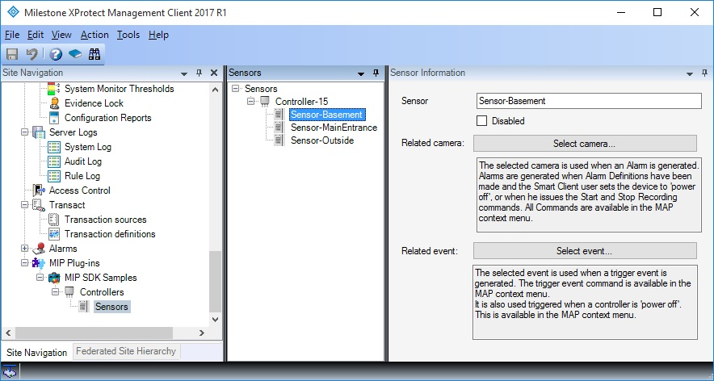
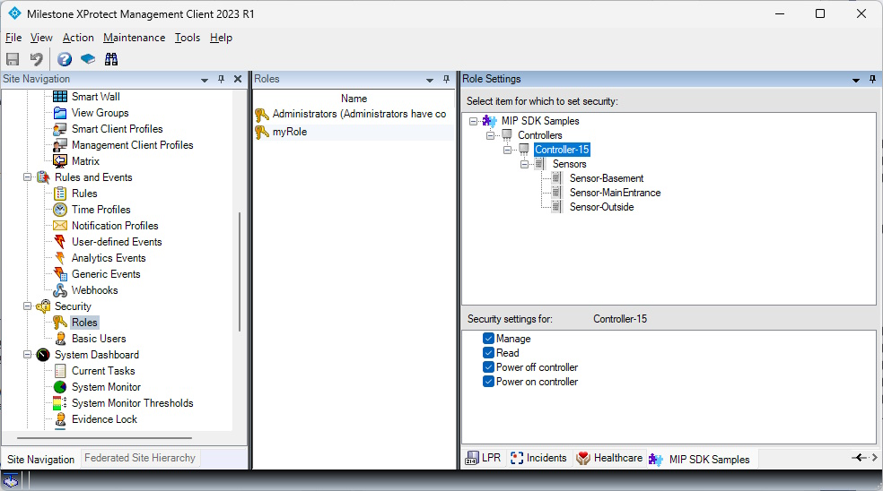
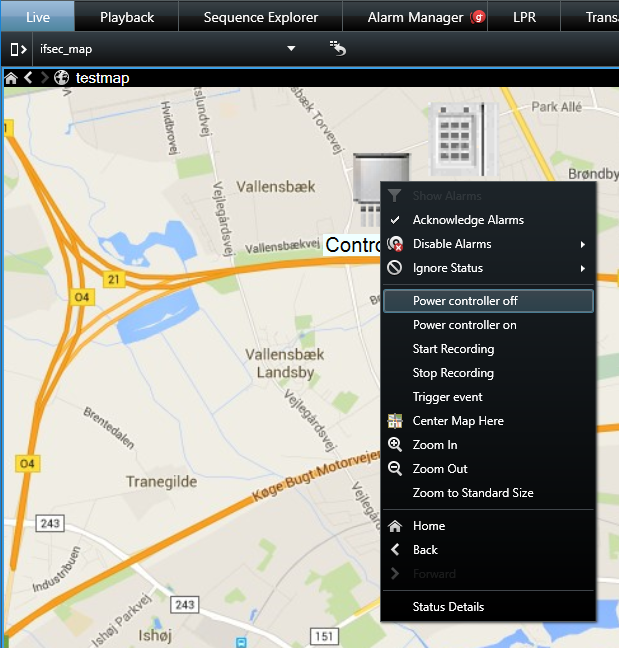

# Sensor Monitor

The SensorMonitor sample involves configuration in the XProtect
Management Client, loading in the event server, and display and
navigation in the Smart Client\'s Map and Smart Map view items. The
sample does not carry out any real communication with a device.

*(Was previously named \"Access Control (MIP SDK v. 2.0)\")*

In the Management Client, configuration of a controller with three
sensors looks like this:

Apart from the name of the item itself, we have not added any other
configuration.

When these items have been configured, select Security \> Roles, and
configure role settings for each relevant role. The Server Monitor items
will be individually selectable for each role in the system. Inheritance
is possible for quick setup.

In the Smart Client, when in setup mode, the
puzzle icon is selected for dragging plug-in items to the map.

In the Smart Client, when in normal mode, the plug-in items will display the current state, as
received by the plug-in in the event Server, and context menu can be
opened by a right mouse click -- as seen below.

When a map is displayed in the Smart Client, the plug-in delivers the
controllers and doors configured elsewhere (In the Management Client in
this case) to the Event Server, that again passes these on to the map
view item in the Smart Client.

In the context menu, the defined context menu items for the particular
item kind appears above all other context menu lines. In this sample we
added the context menu items \"Power controller on\", \"Power controller
off\", \"Start Recording\" and \"Stop Recording\" to the sample to
illustrate this. When the context menu items are selected by a user, the
commands are passed on to the plug-in for interpretation, and the item
may change state based on the command.

There is also two context menu items named \"Start Recording\" and
\"Stop Recording\". Selecting these items will pass on the command to
the plug-in executing in the Event Server and the plug-in will issue the
requested command on the cameras configured to be related to the
controllers.

The icon on the map becomes red, and any alarm definitions configured to
react to this state will issue a new alarm on the alarm list (Not showed
on this page).

For Sensor items, there are an \"Activate Sensor\" and a \"Deactivate
Sensor\" context menu command. These commands are interpreted by the
SensorMonitor sample running in the Event Server and simulates that
these command are in fact executed elsewhere. The Icon on the map will
change to indicate when a sensor is activate.

Furthermore, the sample also demonstrates how to provide translations
for the plugin specific layers and context menu on Smart Map.
Translations are only provided for Danish (and the default, English).

Finally, it also shows how to make a plug-in rule action by implementing
a \"Start controller\" action that can be utilized in the rules.

## The sample demonstrates

-   How to create a plug-in for the event server for integration of
    external devices such as sensors.
-   How to issue context menu commands from the map to the plug-in.
-   How to provide translations for Smart Map.
-   How to implement plug-in rule actions.
-   Authorization of plug-in defined items.

## Using

-   VideoOS.Platform.Background.BackgroundPlugin
-   VideoOS.Platform.ItemManager
-   VideoOS.Platform.Messaging.Message

## Environment

-   MIP environment for event server and administration

## Visual Studio C\# project

-   [SensorMonitor.csproj](javascript:openLink('..\\\\PluginSamples\\\\SensorMonitor\\\\SensorMonitor.csproj');)

## Special notes

-   Smart Map is only available on XProtect Expert and
Corporate
-   Restart Event Server if controller created in Management Client is not available in setup mode of Smart Client
